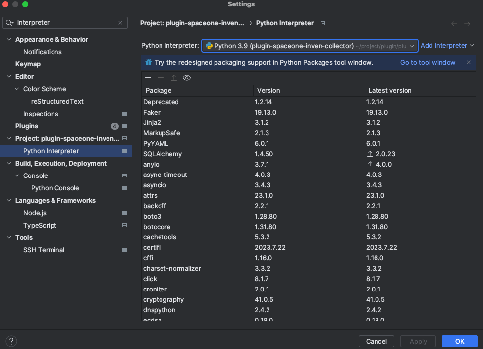
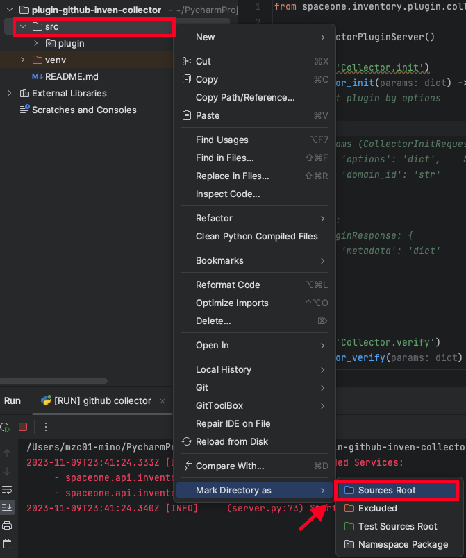
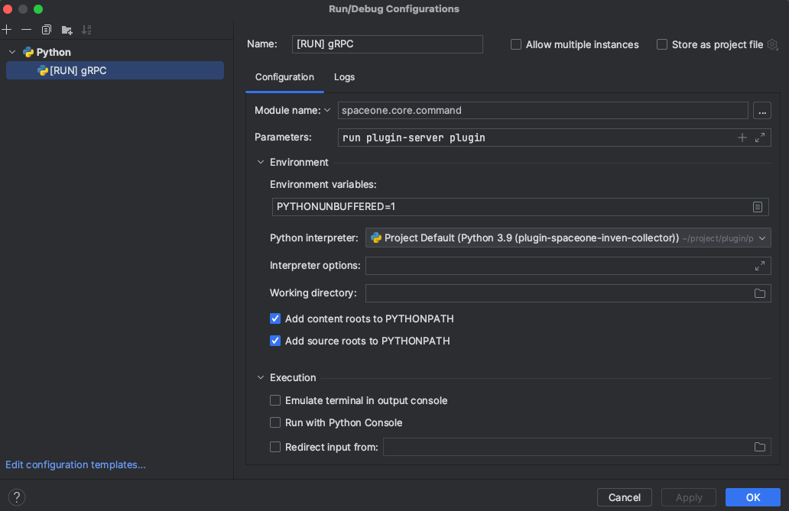
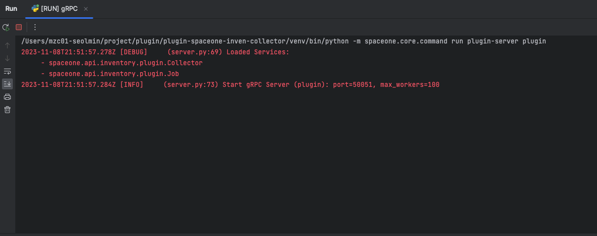

# plugin-github-inven-collector

## Introduction
**plugin-spaceone-inven-collector** is an Inventory Collector Plugin for SpaceONE, designed to collect resources from Github.
This plugin has been developed with a new plugin framework.

## Setup and Run
Since the current spaceone-inventory package is in a pre-release state, follow the steps below to configure the package.

### 1. Virtual Environment Setup
Set up a virtual environment using the venv library.
```bash
python3 -m venv venv
```
```bash
source venv/bin/activate
```

### 2. Package Installation
Install the package with the following commands in the created virtual environment.

```bash
pip3 install -r pkg/pip_requirements.txt
pip3 install --pre spaceone-inventory
```

### 3. Interpreter Configuration
If you are using PyCharm, configure the virtual environment as the interpreter.




After following the above steps, run the Plugin Server.


## Local Environment Testing
After running the Plugin Server, **perform tests for each method** with the following commands.

### Check available API methods:

```bash
spacectl api-resources
```

#### Collector.init
```
spacectl exec init inventory.Collector -f test/init.yml
```


#### Collector.verify

```bash
spacectl exec verify inventory.Collector -f test/verify.yml
```

#### Collector.collect

```bash
spacectl exec collect inventory.Collector -f test/collect.yml
```

#### Note
Metadata will be defined as a dictionary and will be converted to YAML.
The spaceone-inventory package is in a pre-release state, so the `--pre` option must be added when using pip install.